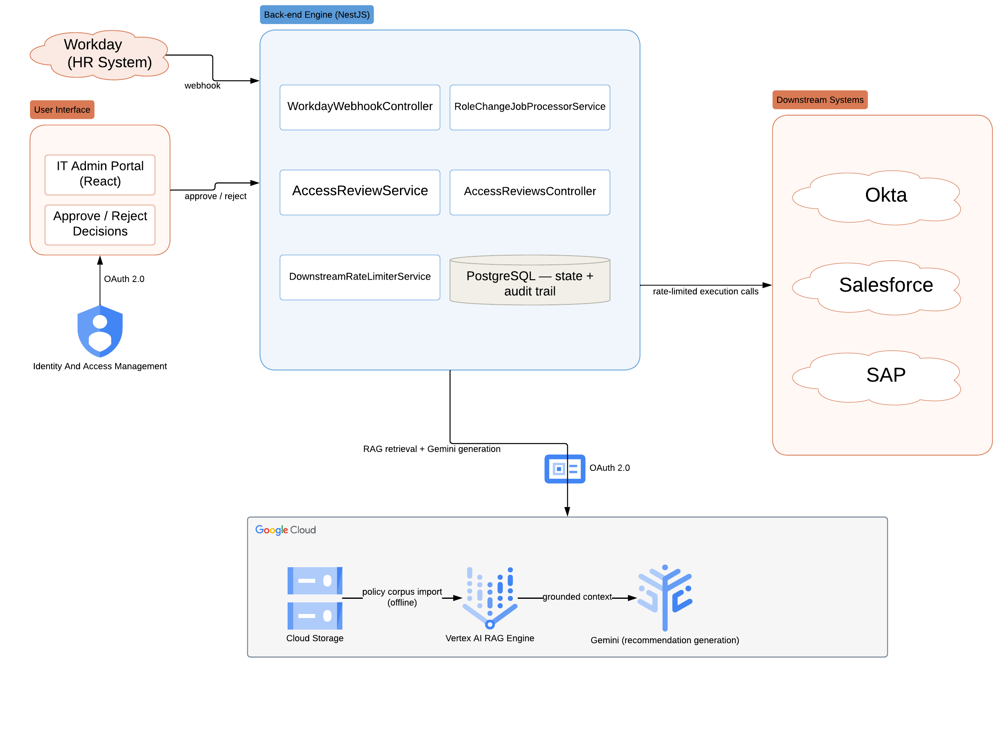

# Lifecycle-Sync — Intelligent Employee Role-Change Access Review
## 1. Problem Statement

When an employee changes role, department, or cost center at TechGlobal, their existing access in systems like Salesforce, Okta, and SAP doesn't automatically get reviewed. Today that review is manual: an IT admin has to look up the employee's current entitlements in PostgreSQL, separately read through unstructured policy PDFs to figure out what the new role should and shouldn't have, and then decide what to keep, remove, or add. There's no automated link between a role-change event and the access it should affect, no tracking of which changes have been reviewed, and no consistent audit trail tying an access change back to the policy that justified it.

This doesn't scale. Role changes happen constantly, restructures can generate hundreds of them at once, and a manual process means access reviews are slow, inconsistent between admins, and easy to skip — leaving employees with access they shouldn't have for however long it takes someone to notice.

Lifecycle-Sync automates the review itself — detecting the role change, retrieving the right policy context, and proposing what should change — while keeping a human in control of every actual access mutation.

## 2. Solution Summary

When an employee's role changes in Workday, the system automatically looks up their current access, checks it against company policy, and has an AI suggest what to keep, remove, or add — with a reason for each suggestion.
Nothing actually changes until a human reviews and approves it, and even then, changes are sent to each system (Okta, Salesforce, SAP) at a safe, controlled pace so nothing gets overwhelmed.

## 3. Scope & Assumptions

**In scope:** event ingestion, idempotency, policy retrieval and grounding, recommendation generation, human approval workflow, rate-limited execution, audit logging.

**Out of scope / mocked for this exercise:**
- Downstream systems (Okta, Salesforce, SAP) — represented by a stub adapter, not live vendor integrations. The exercise targets the governance and control-boundary logic, not third-party API integration.
- Live GCP configuration — `GCP_PROJECT_ID`, `VERTEX_RAG_CORPUS_ID`, and `VECTOR_INDEX_ID` are left unset in `.env.example`; local runs use `VERTEX_RAG_MOCK_ENABLED=true`, which returns a fixture policy chunk instead of a live Vertex AI RAG Engine call.
- All policy documents, entitlement records, and event payloads use fictitious data, per the exercise's confidentiality constraint.
- The React dashboard is scoped to the approval decision surface (the human-in-the-loop control point), not a full admin console.

## 4. Architecture

The system separates into two phases that execute on different triggers: **ingestion** (offline, triggered by policy document changes) and **retrieval** (online, triggered per role-change event). This separation is deliberate — retrieval must never wait on ingestion work, and ingestion has no per-event cost.

*Left to right: Workday triggers the Back-end Engine over webhook; the React dashboard (behind Okta admin SSO) reads/approves recommendations; the Back-end Engine retrieves policy context and generates recommendations via Google Cloud (Cloud Storage → Vertex AI RAG Engine → Gemini), and executes approved changes against downstream systems through a rate limiter.*

Editable diagrams (Lucidchart):
- System architecture (above): https://lucid.app/lucidchart/bf6feff6-8179-48f5-b521-dcc7b4b4a591/view
- Detailed component flow (per-arrow request path): https://lucid.app/lucidchart/b4f0a1b8-50f4-46e1-a234-5543a96106af/view
- Database ERD: https://lucid.app/lucidchart/75414794-8ab7-4584-b4e5-4a20f60dd430/view

### 4.1 Ingestion — policy documents to vector store

Runs once per policy document, independent of event volume:

| Step | Action | Owner |
|---|---|---|
| 1 | Source PDF lands in GCS (`gs://lifecyclesync-policy-docs/...`) | External (policy authoring process) |
| 2 | Document parsed and partitioned into chunks | Vertex AI RAG Engine (managed) |
| 3 | Chunks embedded | Vertex AI RAG Engine (managed) |
| 4 | Embeddings indexed | Vertex AI RAG Engine (managed) |
| 5 | Indexed vectors persisted to the corpus's backing store | Vertex AI RAG Engine (managed) |

Steps 2–5 are what the assignment refers to as the **"GCP Vertex AI/Vector Search endpoints"**: Vertex AI RAG Engine is the managed layer in front of that store — this system calls RAG Engine's retrieval API and never manages chunking, embedding, or the index directly.

**Configuration status:** GCP project configuration is mocked for this exercise (`VERTEX_RAG_MOCK_ENABLED=true`); the architectural decision under evaluation is the ingestion/retrieval boundary and what each side owns, not a live GCP deployment.

**Exit condition:** the vector store holds indexed, embedded policy chunks, each retrievable by similarity search and tagged with a `sectionId` and `policyVersion` extracted from the chunk text. Retrieval depends only on this exit condition — it has no dependency on how ingestion reached it.

### 4.2 Retrieval — webhook to database state change

Runs once per role-change event:

1. **Ingestion (event).** `WorkdayWebhookController` validates the payload and inserts it as `RoleChangeEvent` + `ProcessingJob` in one transaction, keyed on a unique `eventId`. A retried webhook delivery hits the unique constraint and returns `DUPLICATE_ACCEPTED` — idempotency is structural, not a manual check. The controller returns `202 Accepted` immediately regardless of downstream capacity, so a 300 events/minute restructure burst is absorbed here without being coupled to the 60 req/min limit downstream systems actually enforce.
2. **Queue pickup.** `RoleChangeJobProcessorService` polls every 5 seconds, claims the job via a conditional update (concurrency-safe against multiple workers), and invokes `AccessReviewService`.
3. **Context assembly.** `AccessReviewService` reads the employee's active entitlements from PostgreSQL and builds a natural-language retrieval query from the role transition.
4. **Retrieval.** The query is sent to the Vertex AI RAG corpus built in 4.1; returned chunks carry their `sectionId`/`policyVersion`.
5. **Recommendation generation.** Entitlements + retrieved policy context are sent to Gemini, which returns a schema-validated action (`KEEP`/`REMOVE`/`ADD`) per entitlement with a citation and confidence score. Latency, token counts, and estimated cost for this call are written to `LlmEvaluationMetric` in the same step — not a separate logging pass that could drift out of sync with what was actually generated.
6. **Grounding check.** Each citation is matched against the `sectionId`s actually retrieved in step 4. An unmatched citation is marked `NEEDS_REVIEW`, not `SUPPORTED` — the system does not trust the model's citation without verification.
7. **Human-in-the-loop checkpoint.** Recommendations are persisted (`RecommendationItem`, status `PENDING_APPROVAL`) and surfaced on the dashboard with action, rationale, citation, and grounding status. No downstream system has been touched at this point.
8. **Approval.** An admin approves or rejects via `AccessReviewsController`. Only approved ADD/REMOVE recommendations generate `ExecutionTask` rows.
9. **Execution.** `DownstreamRateLimiterService` enforces 60 req/min per downstream system before the adapter executes the mutation. A saturated system leaves its task `PENDING` for the next window rather than failing.

### 4.3 Guardrails

- **Deterministic boundary.** The LLM never executes an API mutation. It writes recommendations to `RecommendationItem`; only a human decision (step 8) can create an `ExecutionTask`, and only `DownstreamRateLimiterService` — deterministic code, not the model — calls the downstream adapter.
- **PII masking.** Employee identifiers and cost-center values are masked (`maskEmployeeId`, `maskCostCenter`) at the point a log line is written, not as a downstream scrubbing pass — logs and telemetry never carry raw PII.
- **Dashboard boundary.** The React dashboard only ever calls `AccessReviewsController` to read recommendations and post a decision. It has no path to Okta, Salesforce, or SAP — execution is reachable only through the approval → rate-limiter → adapter chain in step 9.

### 4.4 Database State Transitions

| Table | State progression |
|---|---|
| `RoleChangeEvent.status` | `RECEIVED` → `PROCESSING` → `COMPLETED` |
| `AccessReviewRequest.status` | `PENDING_RECOMMENDATION` → `PENDING_APPROVAL` → `APPROVED`/`REJECTED` → `EXECUTION_PENDING` |
| `RecommendationItem` | inserted once per entitlement (action, citation, confidence); immutable after creation |
| `ApprovalDecision` | one row inserted at the human decision point |
| `ExecutionTask.status` | `PENDING` → `COMPLETED` (or held `PENDING` under rate-limit saturation) |
| `EmployeeEntitlement` | updated only after successful execution — reflects actual post-change access |
| `AuditLog` | one append-only row per transition above |

This table is the direct answer to "how do you verify the system did what it claims" — every state change is a persisted row, not a log line.

---